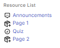

# Resource List Block

This plugin enhances course navigation in Moodle by displaying a clean and organized list of course resources and activities in a block, filtered by type. It improves the user experience for students and educators, making it easier to access relevant content.

## Features

- Display course resources and activities within a block.
- Filter the list by resource or activity type for better usability.
- Fully configurable to match course requirements.
- User-friendly interface to select and organize displayed resources.

## Requirements

- **Moodle**: Compatible with Moodle 4.0 or higher.
- **PHP**: Ensure a PHP version supported by [Moodle 4.0 or higher](https://docs.moodle.org/400/en/Installing_Moodle#Requirements).

## Installation

There are two methods to install the plugin:

### Method 1: Manual Installation

1. Download and extract the plugin into the Moodle blocks directory:  
   `moodle/blocks/resource_list`.
2. Log in as an admin to your Moodle site.
3. Navigate to **Site Administration > Notifications** to complete the installation process.
4. Configure and add the block to desired courses through the Moodle interface.

### Method 2: Install via ZIP File

1. Download the plugin as a ZIP file.
2. Log in as an admin to your Moodle site.
3. Navigate to **Site Administration > Plugins > Install plugins**.
4. Upload the ZIP file and follow the on-screen instructions.
5. After installation, navigate to **Site Administration > Notifications** to finalize the process.
6. Configure and add the block to desired courses through the Moodle interface.

## Configuration

- Customize block settings using the form defined in `edit_form.php`.
- Add the block to courses and configure its display options.
- The plugin allows you to:
  - Add a custom title for the block.
  - Add a description to provide additional context.
  - Select which activities or resources to display in the list. You can choose one or multiple items.
    - To select multiple items, hold down the **CTRL** key (or **CMD** on Mac) while clicking.

## Localization

The `lang` directory contains translation files. To add support for a new language:

1. Create a subdirectory in the `lang` folder with the language code (e.g., `it` for Italian).
2. Add the necessary translation files following the structure of existing ones.

## Screenshots

Here is an example of how the block appears in Moodle:

## Contributing

Contributions are welcome! Here’s how you can help:

1. Fork this repository.
2. Create a feature branch: `git checkout -b feature-name`.
3. Commit your changes: `git commit -m 'Add feature'`.
4. Push to the branch: `git push origin feature-name`.
5. Open a pull request.

### Additional Contributions

- If you test the plugin on other versions of Moodle, please share your findings. This would help improve the documentation and ensure compatibility with a wider range of configurations.
- Suggestions for improvements or reporting issues are always appreciated.

## License

This plugin is released under the [GPLv3 License](https://www.gnu.org/licenses/gpl-3.0.html).

## Contact

For questions or suggestions, contact the project administrator or open an issue on GitHub.
